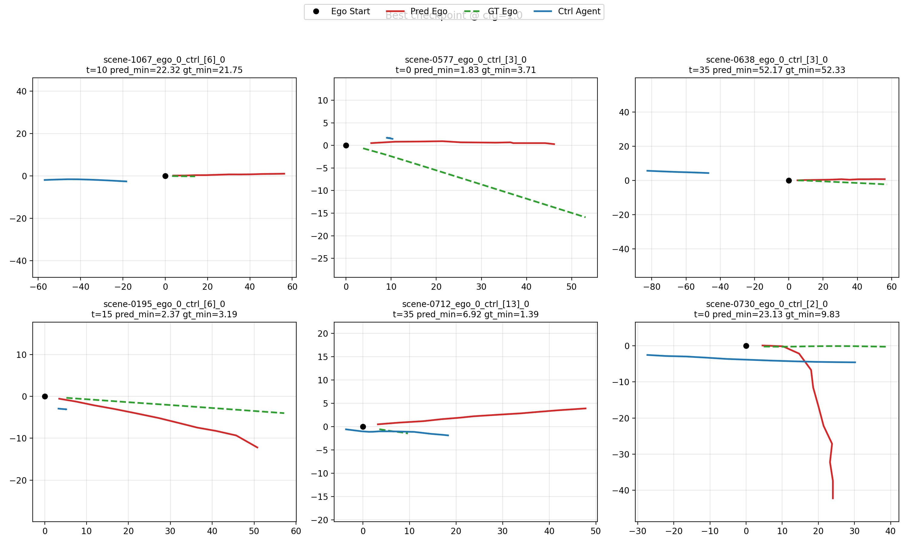
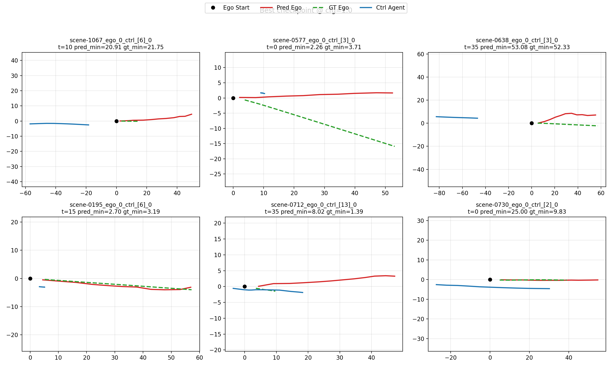
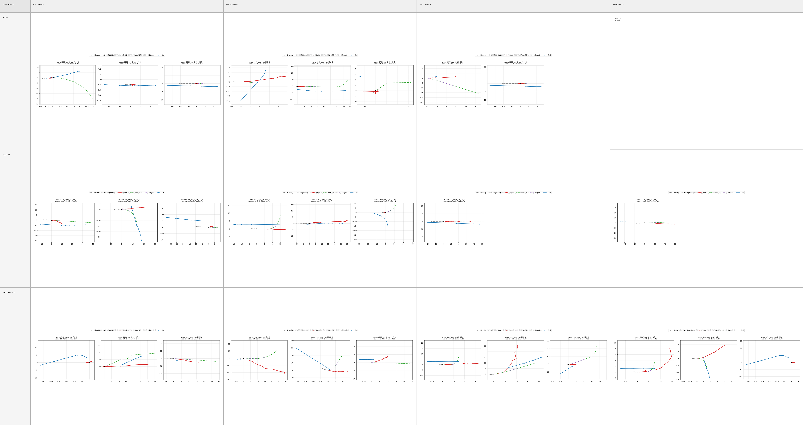

# GoalFlow / SafeSim Workspace

English | [简体中文](README.zh-CN.md)

This repository now serves two purposes:

1. the original **GoalFlow (CVPR 2025)** codebase and paper-era materials
2. an actively developed **SafeSim dangerous trajectory generation** research line built on top of GoalFlow

The root README is the entrypoint for the **current workspace state**. The original paper-style README has been preserved at:

- [docs/legacy/goalflow-original-readme.md](docs/legacy/goalflow-original-readme.md)

## What Is Current

The current SafeSim line is not a direct replay of the original paper setup. The active objective is to build and validate a corrected training pipeline for dangerous trajectory generation with:

- corrected supervision and evaluation logic
- explicit `goal_point` conditioning
- protocol-based evaluation instead of loss-only comparison

The active formulation is:

```text
history/start state + scene context + goal_point -> trajectory
```

not the older:

```text
scene context -> imitate full trajectory
```

## Experiment Snapshot Table

The table below tracks only the experiment lines that are still relevant to the
current workspace. Historical lines invalidated by the old
`nearest_action_sample` supervision bug are intentionally excluded from the main
table and kept in the archive.

| Scenario | Role | Supervision | Goal Point | Status | dangerous_hit_rate | hit@2m | pred_min_dist | Notes |
|---|---|---|---|---|---:|---:|---:|---|
| SafeSim Baseline | historical reference | legacy baseline line | no explicit goal token | evaluated (historical reference) | 0.2812 | 0.1562 | 12.9143 | Reference-only snapshot from earlier proxy eval |
| Stage1 Prior Alignment | transfer reference | `raw_gt` on `original` | no explicit goal token | evaluated (historical reference) | 0.2188 | 0.0781 | 13.4077 | Shows transferred prior before corrected Stage2 |
| Goal-conditioned Pure Imitation | current valid baseline | `action` | explicit `goal_point` | trained, queued for protocol evaluation | TBD | TBD | TBD | First corrected baseline after bug fixes |
| Goal-conditioned Terminal Ablation | current valid ablation | `action` | explicit `goal_point` | training completed, protocol evaluation in progress | TBD | TBD | TBD | Current active ablation line |
| Goal-conditioned Softmin Ablation | next ablation | `action` | explicit `goal_point` | pending automatic launch after terminal base selection | TBD | TBD | TBD | Small-weight sweep on corrected terminal base |

## Current Status

This workspace already includes:

- the root-cause fix for the broken `nearest_action_sample` supervision path
- corrected candidate selection during inference/evaluation
- explicit `goal_point` conditioning in the SafeSim line
- a completed **goal-conditioned pure imitation** training baseline
- reorganized documentation with active vs archived separation

This workspace does **not** yet include final ablation conclusions. The remaining required work is:

- formal evaluation of the corrected pure imitation baseline
- formal evaluation and selection of the goal-conditioned `terminal` sweep
- follow-up small `softmin` sweep on the selected terminal base

This means the repository is currently in a good state for:

- code review
- documentation review
- experiment resumption

but not yet for claiming final model conclusions.

## Read First

1. Current experiment index  
   [docs/reports/2026-05-04-safesim-experiment-index.md](docs/reports/2026-05-04-safesim-experiment-index.md)

2. Current evaluation protocol  
   [docs/metrics/safesim-dangerous-metrics-v1.md](docs/metrics/safesim-dangerous-metrics-v1.md)

3. General docs index  
   [docs/README.md](docs/README.md)

4. Original GoalFlow install/train/test docs  
   [docs/install.md](docs/install.md)  
   [docs/train.md](docs/train.md)  
   [docs/test.md](docs/test.md)

5. Historical SafeSim archive  
   [docs/archive/README.md](docs/archive/README.md)

## Effective Experiment Lines

Only the lines below should be treated as current and technically valid.

| Experiment | Purpose | Status | Entry |
|---|---|---|---|
| Stage 1 prior alignment | Transfer GoalFlow FM head into SafeSim structured-input training | Completed | [scripts/training/run_safesim_stage1.sh](scripts/training/run_safesim_stage1.sh) |
| Goal-conditioned pure imitation | Corrected baseline with `target_policy=action` and explicit `goal_point` | Training completed, evaluation pending | [scripts/training/run_safesim_stage2_action_imitation.sh](scripts/training/run_safesim_stage2_action_imitation.sh) |
| Goal-conditioned terminal sweep | Ablation over `terminal_xy` / `terminal_heading` with corrected setup | Training complete; evaluation now part of the active mainline | [scripts/training/run_safesim_stage2_terminal_sweep.sh](scripts/training/run_safesim_stage2_terminal_sweep.sh) |
| Goal-conditioned softmin sweep | Planned next step after selecting a terminal base | Not started yet on the corrected mainline | [scripts/training/run_safesim_stage2_softmin_sweep.sh](scripts/training/run_safesim_stage2_softmin_sweep.sh) |
| Goal-action mainline orchestrator | Finish terminal sweep, run evaluation, choose terminal base, launch softmin sweep | Running | [scripts/training/run_safesim_goal_action_mainline.sh](scripts/training/run_safesim_goal_action_mainline.sh) |

## Invalidated Historical Experiments

Older Stage 2 ablations based on `target_policy=nearest_action_sample` should not be used as final evidence. They remain useful only as debugging history because the corresponding `action_sample_positions / yaws` in the current filtered data were found to be invalid.

Use the archive and experiment index for those details instead of treating them as live results.

## Scenario Sections

### Original GoalFlow context

This section is the paper-era reference point for the repository.


### Scenario 1: SafeSim baseline reference

This is a historical from-scratch SafeSim reference. It is kept in the README
because it remains useful as a qualitative anchor, but it is not the active
mainline experiment.



### Scenario 2: Stage1 prior-alignment reference

This section shows the transferred SafeSim model before corrected Stage2
ablation. It is useful for understanding the starting prior before the new
goal-conditioned fine-tuning line.



### Scenario 3: Goal-conditioned pure imitation

This is the first corrected baseline under:

- `target_policy = action`
- explicit `goal_point`
- no `terminal`
- no `softmin`

Training has completed, but formal protocol evaluation is still pending. The
section is kept here because it is the baseline that all new ablations must be
compared against.

### Scenario 4: Goal-conditioned terminal ablation

This is the currently active ablation family. Terminal training has completed
and the corrected mainline is now pushing through formal evaluation so it can
select the terminal base for the next softmin sweep.



### Scenario 5: Goal-conditioned softmin ablation

This is the next planned experiment family. It will start automatically after a
terminal base is selected from the corrected goal-conditioned line.

## Main Code Entry Points

### Original GoalFlow

- Trajectory model: [navsim/agents/goalflow/goalflow_model_traj.py](navsim/agents/goalflow/goalflow_model_traj.py)
- Goal-point model: [navsim/agents/goalflow/goalflow_model_navi.py](navsim/agents/goalflow/goalflow_model_navi.py)
- Original trajectory training script: [scripts/training/run_goalflow_training_traj.sh](scripts/training/run_goalflow_training_traj.sh)

### SafeSim Research Line

- Common training entry: [navsim/agents/goalflow/run_safesim_training.py](navsim/agents/goalflow/run_safesim_training.py)
- Agent: [navsim/agents/goalflow/safesim_agent.py](navsim/agents/goalflow/safesim_agent.py)
- Dataset: [navsim/agents/goalflow/safesim_dataset.py](navsim/agents/goalflow/safesim_dataset.py)
- Encoder: [navsim/agents/goalflow/safesim_encoder.py](navsim/agents/goalflow/safesim_encoder.py)
- Model: [navsim/agents/goalflow/safesim_model.py](navsim/agents/goalflow/safesim_model.py)
- Config: [navsim/agents/goalflow/safesim_config.py](navsim/agents/goalflow/safesim_config.py)

## Evaluation

Formal comparison should use the protocol evaluator, not training loss alone.

- Main evaluator: [scripts/analysis/evaluate_safesim_dangerous.py](scripts/analysis/evaluate_safesim_dangerous.py)
- Terminal sweep evaluation: [scripts/analysis/run_safesim_terminal_sweep_eval.sh](scripts/analysis/run_safesim_terminal_sweep_eval.sh)
- Softmin sweep evaluation: [scripts/analysis/run_safesim_softmin_sweep_eval.sh](scripts/analysis/run_safesim_softmin_sweep_eval.sh)

## Large Artifacts Kept Out of Git

Large experiment artifacts are intentionally ignored by `.gitignore` and should
be shared through cloud storage or a lab file server instead of this Git
repository.

Recommended external-share items:

- [safesim_logs_stage1](/Users/linyuxuan/workSpace/GoalFlow/safesim_logs_stage1) (`~1.6G`)
- [safesim_logs_cfg_base](/Users/linyuxuan/workSpace/GoalFlow/safesim_logs_cfg_base) (`~1.4G`)
- [safesim_logs_stage2_action_goal_imitation](/Users/linyuxuan/workSpace/GoalFlow/safesim_logs_stage2_action_goal_imitation) (`~1.7G`)
- [safesim_logs_stage2_terminal_sweep_goal_action](/Users/linyuxuan/workSpace/GoalFlow/safesim_logs_stage2_terminal_sweep_goal_action) (`~75G`, current largest directory)

Recommended to commit:

- code under [navsim/agents/goalflow](/Users/linyuxuan/workSpace/GoalFlow/navsim/agents/goalflow)
- lightweight helper code under [navsim/safesim](/Users/linyuxuan/workSpace/GoalFlow/navsim/safesim)
- scripts under [scripts/analysis](/Users/linyuxuan/workSpace/GoalFlow/scripts/analysis) and [scripts/training](/Users/linyuxuan/workSpace/GoalFlow/scripts/training)
- tests under [tests](/Users/linyuxuan/workSpace/GoalFlow/tests)
- small README assets under [assets/safesim_current](/Users/linyuxuan/workSpace/GoalFlow/assets/safesim_current)

## Environment

```bash
conda create -n goalflow python=3.10
conda activate goalflow
pip install -r requirements.txt
pip install -e nuplan-devkit
pip install -e .
```

For the original paper workflow, continue with:

- [docs/install.md](docs/install.md)
- [docs/train.md](docs/train.md)
- [docs/test.md](docs/test.md)

## Paper and Legacy Materials

- Paper: [GoalFlow: Goal-Driven Flow Matching for Multimodal Trajectories Generation in End-to-End Autonomous Driving](https://arxiv.org/abs/2503.05689)
- Project page: [GoalFlow Project Page](https://zebinx.github.io/HomePage-of-GoalFlow/)
- Original archived README: [docs/legacy/goalflow-original-readme.md](docs/legacy/goalflow-original-readme.md)
