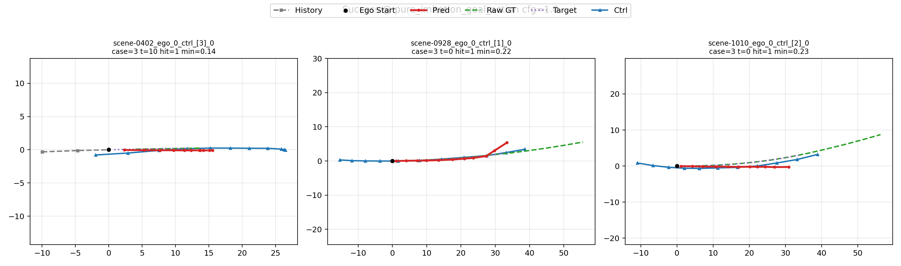
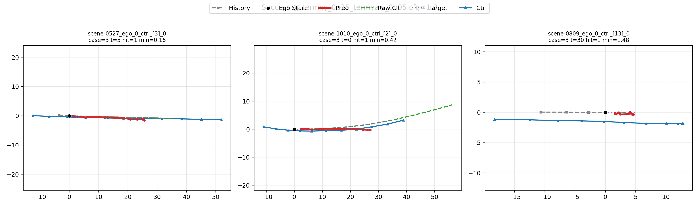
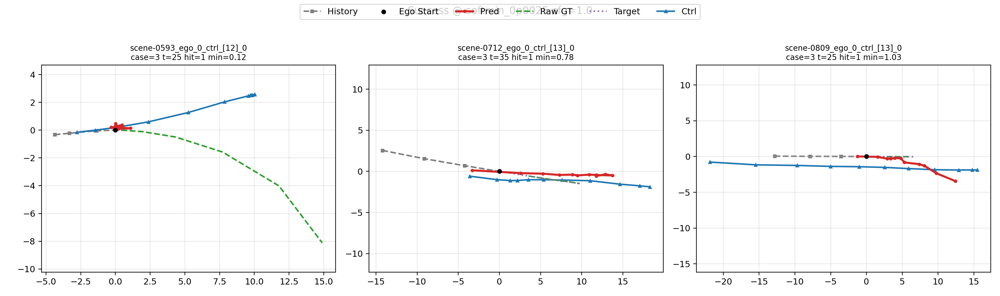

# GoalFlow / SafeSim 工作区

[English](README.md) | 简体中文

这个仓库当前同时承担两类内容：

1. 原版 **GoalFlow（CVPR 2025）** 代码与论文时期资料
2. 基于 GoalFlow 扩展出来的 **SafeSim 危险轨迹生成** 研究主线

根目录 README 现在作为**当前工作区状态**的入口。原始论文风格 README 已归档到：

- [docs/legacy/goalflow-original-readme.md](docs/legacy/goalflow-original-readme.md)

## 当前主线是什么

当前 SafeSim 主线不是简单复现原版论文，而是在做一条经过修正的危险轨迹生成实验链，重点包括：

- 修复监督和评估逻辑中的关键问题
- 恢复显式 `goal_point` 条件
- 用正式协议评估，而不是只看训练 `loss`

当前有效的训练形式是：

```text
history/start state + scene context + goal_point -> trajectory
```

而不是较早那条：

```text
scene context -> imitate full trajectory
```

## 实验总表

下面这张总表只跟踪**当前仍然相关**的实验线。那些被旧
`nearest_action_sample` 监督 bug 污染的历史实验，不再放进主表，而是保存在归档里。

| Scenario | 角色 | 监督 | Goal Point | 状态 | dangerous_hit_rate | hit@2m | pred_min_dist | 说明 |
|---|---|---|---|---|---:|---:|---:|---|
| SafeSim Baseline | 历史参考 | 旧 baseline 训练线 | 无显式 goal token | 已评估（历史参考） | 0.2812 | 0.1562 | 12.9143 | 早期 proxy 评估留下的参考快照 |
| Stage1 Prior Alignment | transfer 参考 | `raw_gt` on `original` | 无显式 goal token | 已评估（历史参考） | 0.2188 | 0.0781 | 13.4077 | 展示 corrected Stage2 之前的迁移先验 |
| Goal-conditioned Pure Imitation | 当前有效 baseline | `action` | 显式 `goal_point` | 已完成正式测评 | 0.4219 | 0.3125 | 9.6171 | bug 修复后的干净 baseline；`gate_pass=False` |
| Goal-conditioned Terminal Ablation | 当前有效 ablation | `action` | 显式 `goal_point` | 已完成正式测评 | 0.4688 | 0.3125 | 9.2413 | 最优 terminal-only 为 `xy=0.25, heading=0.05`；`gate_pass=False` |
| Goal-conditioned Softmin Ablation | 当前有效 ablation | `action` | 显式 `goal_point` | 已完成正式测评 | 0.5156 | 0.3438 | 4.6922 | 最优 corrected softmin 为 `0.0025`；`gate_pass=False` |

## 当前进展

目前已经完成：

- `nearest_action_sample` 旧监督问题的定位与修复
- 推理/评估阶段 candidate 选择逻辑修复
- SafeSim 主线中的显式 `goal_point` 条件接入
- **goal-conditioned pure imitation** baseline 训练完成
- 文档与历史材料分层归档

当前 corrected goal-conditioned mainline 已经全部跑完：

- 修复后 pure imitation baseline 的正式协议评估
- 新版 goal-conditioned `terminal` 消融的正式评估与 base 选择
- 在选定 terminal base 之后的新 `softmin` sweep 及其正式评估

当前剩下的主要问题不再是“实验没跑完”，而是模型质量：

- corrected mainline 的危险指标已经明显提升
- 但所有当前组合都还没有通过协议 gate，主要卡在 `offroad_rate` 和运动合理性

因此，当前仓库已经适合：

- 做代码审阅
- 做文档审阅
- 恢复后续实验

但还不适合拿来宣称最终实验结论。

## 建议阅读顺序

1. 当前实验总索引  
   [docs/reports/2026-05-04-safesim-experiment-index.md](docs/reports/2026-05-04-safesim-experiment-index.md)

2. 当前测评协议  
   [docs/metrics/safesim-dangerous-metrics-v1.md](docs/metrics/safesim-dangerous-metrics-v1.md)

3. 文档总索引  
   [docs/README.md](docs/README.md)

4. 原版 GoalFlow 的安装 / 训练 / 测试文档  
   [docs/install.md](docs/install.md)  
   [docs/train.md](docs/train.md)  
   [docs/test.md](docs/test.md)

5. 历史 SafeSim 归档  
   [docs/archive/README.md](docs/archive/README.md)

## 当前有效实验线

只有下面这些实验线应该被视为当前仍然有效、值得继续推进的主线。

| 实验 | 作用 | 状态 | 入口 |
|---|---|---|---|
| Stage 1 prior alignment | 将 GoalFlow FM head 迁移到 SafeSim 结构化输入训练 | 已完成 | [scripts/training/run_safesim_stage1.sh](scripts/training/run_safesim_stage1.sh) |
| Goal-conditioned pure imitation | 使用 `target_policy=action` 和显式 `goal_point` 的修正 baseline | 已训练并测评 | [scripts/training/run_safesim_stage2_action_imitation.sh](scripts/training/run_safesim_stage2_action_imitation.sh) |
| Goal-conditioned terminal sweep | 在修正后的设置下扫描 `terminal_xy` / `terminal_heading` | 已训练并测评 | [scripts/training/run_safesim_stage2_terminal_sweep.sh](scripts/training/run_safesim_stage2_terminal_sweep.sh) |
| Goal-conditioned softmin sweep | 在选定 terminal base 后进行 small softmin 扫描 | 已训练并测评 | [scripts/training/run_safesim_stage2_softmin_sweep.sh](scripts/training/run_safesim_stage2_softmin_sweep.sh) |
| Goal-action mainline orchestrator | 跑完 terminal、完成评估、选 terminal base、启动 softmin sweep | 已完成 | [scripts/training/run_safesim_goal_action_mainline.sh](scripts/training/run_safesim_goal_action_mainline.sh) |

## 已失效的历史实验

旧的 Stage 2 消融如果建立在 `target_policy=nearest_action_sample` 上，就不能再作为正式结论，因为当前 `filtered` 数据中的 `action_sample_positions / yaws` 已被确认是无效的。

这些实验仍然保留调试和诊断价值，但不应再作为主结果使用。具体请看实验总索引和归档文档。

## 各 Scenario 分节

### Original GoalFlow context

这一节是仓库的论文时期背景参考。


### Scenario 1: SafeSim baseline reference

这是一个历史上的 from-scratch SafeSim 参考组。它仍然值得保留在 README 中，作为定性的对照锚点，但不是当前正在推进的主线。


### Scenario 2: Stage1 prior-alignment reference

这一节展示的是 corrected Stage2 之前、迁移完成后的先验状态。它的价值在于帮助理解新版微调是从什么轨迹先验出发的。


### Scenario 3: Goal-conditioned pure imitation

这是修复后第一条真正干净的 baseline，满足：

- `target_policy = action`
- 显式 `goal_point`
- 不加 `terminal`
- 不加 `softmin`

它的训练和正式协议测评都已经完成，是当前 corrected mainline 的基线。



### Scenario 4: Goal-conditioned terminal ablation

这一族已经完成正式测评。当前最优的 terminal-only 配置是：

- `terminal_xy = 0.25`
- `terminal_heading = 0.05`

它比 corrected pure imitation 有更高的危险指标，但仍然没有通过协议 gate。




### Scenario 5: Goal-conditioned softmin ablation

这一族也已经完成正式测评。当前最优的 corrected softmin 配置是：

- terminal base: `terminal_xy = 0.25`, `terminal_heading = 0.05`
- `softmin = 0.0025`

这是 corrected mainline 里危险性最强的一组，但依旧没有通过协议 gate。



## 主要代码入口

### 原版 GoalFlow

- 轨迹模型：[navsim/agents/goalflow/goalflow_model_traj.py](navsim/agents/goalflow/goalflow_model_traj.py)
- Goal-point 模型：[navsim/agents/goalflow/goalflow_model_navi.py](navsim/agents/goalflow/goalflow_model_navi.py)
- 原版轨迹训练脚本：[scripts/training/run_goalflow_training_traj.sh](scripts/training/run_goalflow_training_traj.sh)

### SafeSim 研究主线

- 通用训练入口：[navsim/agents/goalflow/run_safesim_training.py](navsim/agents/goalflow/run_safesim_training.py)
- Agent：[navsim/agents/goalflow/safesim_agent.py](navsim/agents/goalflow/safesim_agent.py)
- Dataset：[navsim/agents/goalflow/safesim_dataset.py](navsim/agents/goalflow/safesim_dataset.py)
- Encoder：[navsim/agents/goalflow/safesim_encoder.py](navsim/agents/goalflow/safesim_encoder.py)
- Model：[navsim/agents/goalflow/safesim_model.py](navsim/agents/goalflow/safesim_model.py)
- Config：[navsim/agents/goalflow/safesim_config.py](navsim/agents/goalflow/safesim_config.py)

## 测评

正式比较必须使用协议评估，不能只依赖训练 `loss`。

- 主评估脚本：[scripts/analysis/evaluate_safesim_dangerous.py](scripts/analysis/evaluate_safesim_dangerous.py)
- terminal sweep 评估：[scripts/analysis/run_safesim_terminal_sweep_eval.sh](scripts/analysis/run_safesim_terminal_sweep_eval.sh)
- softmin sweep 评估：[scripts/analysis/run_safesim_softmin_sweep_eval.sh](scripts/analysis/run_safesim_softmin_sweep_eval.sh)

## 不进 Git 的大体积资产

大体积实验资产已经通过 `.gitignore` 排除，建议走网盘、实验室文件服务器或共享盘，而不是提交到 Git 仓库。

建议外部分享的目录：

- [safesim_logs_stage1](/Users/linyuxuan/workSpace/GoalFlow/safesim_logs_stage1)（约 `1.6G`）
- [safesim_logs_cfg_base](/Users/linyuxuan/workSpace/GoalFlow/safesim_logs_cfg_base)（约 `1.4G`）
- [safesim_logs_stage2_action_goal_imitation](/Users/linyuxuan/workSpace/GoalFlow/safesim_logs_stage2_action_goal_imitation)（约 `1.7G`）
- [safesim_logs_stage2_terminal_sweep_goal_action](/Users/linyuxuan/workSpace/GoalFlow/safesim_logs_stage2_terminal_sweep_goal_action)（约 `75G`，当前最大）

建议提交进 Git 的内容：

- [navsim/agents/goalflow](/Users/linyuxuan/workSpace/GoalFlow/navsim/agents/goalflow) 下的代码
- [navsim/safesim](/Users/linyuxuan/workSpace/GoalFlow/navsim/safesim) 下的轻量辅助代码
- [scripts/analysis](/Users/linyuxuan/workSpace/GoalFlow/scripts/analysis) 和 [scripts/training](/Users/linyuxuan/workSpace/GoalFlow/scripts/training) 下的脚本
- [tests](/Users/linyuxuan/workSpace/GoalFlow/tests) 下的测试
- [assets/safesim_current](/Users/linyuxuan/workSpace/GoalFlow/assets/safesim_current) 下的小体积 README 图片

## 环境

现在仓库里刻意保留了两套依赖清单：

- [requirements.txt](/Users/linyuxuan/workSpace/GoalFlow/requirements.txt)：原版 GoalFlow / 论文时期环境
- [requirements.safesim-current.txt](/Users/linyuxuan/workSpace/GoalFlow/requirements.safesim-current.txt)：当前 corrected SafeSim goal-conditioned mainline 的已验证环境快照

如果你要复现当前 corrected SafeSim 主线，优先使用：

```bash
conda create -n goalflow python=3.10
conda activate goalflow
pip install -r requirements.safesim-current.txt
pip install -e nuplan-devkit
pip install -e .
```

如果你要走原版论文工作流，则继续使用 `requirements.txt`。

原版环境安装方式：

```bash
conda create -n goalflow python=3.10
conda activate goalflow
pip install -r requirements.txt
pip install -e nuplan-devkit
pip install -e .
```

如果要走原版论文代码流程，继续参考：

- [docs/install.md](docs/install.md)
- [docs/train.md](docs/train.md)
- [docs/test.md](docs/test.md)

## 论文与原版资料

- Paper: [GoalFlow: Goal-Driven Flow Matching for Multimodal Trajectories Generation in End-to-End Autonomous Driving](https://arxiv.org/abs/2503.05689)
- Project page: [GoalFlow Project Page](https://zebinx.github.io/HomePage-of-GoalFlow/)
- 原版归档 README：[docs/legacy/goalflow-original-readme.md](docs/legacy/goalflow-original-readme.md)
